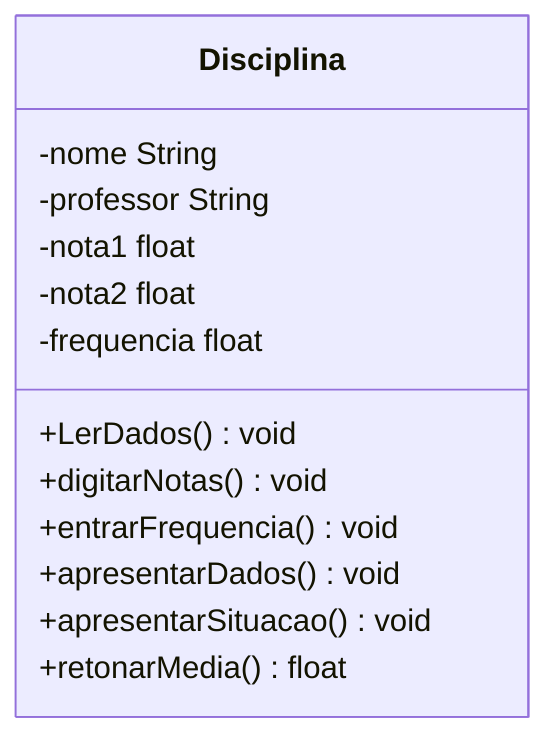

## Exercício 1

Implementar a seguinte classe em Java.

Os métodos devem implementar:

-   lerDados -> preencher a siglas, nome da Disciplina e nome do professor. Pode ser chamado diretamente do construtor.
-   digitarNotas -> permite ao usuário digitar as notas da disciplina;
-   entrarFrequecia -> permite a inclusão da frequência na disciplina;
-   apresentarDados -> apresentar todos os dados da disciplina, sem a situação;
-   apresentarSituação - apresentar a média e a situação do aluno na disciplina que pode ser aprovado se a média for maior ou igual a 6 e a frequência for maior ou igual a 75, retido por falta quando a frequência é menor que 75 e retido por nota quando a média for menor que 6,0.
-   retornarMédia -> retorna a média da disciplina. Esse método tem como retorno um valor float.

Faça uma classe principal capaz de:

1.  Ler 7 disciplinas;
2.  Digitar as notas e frequências dessas disciplinas;
3.  Alterar os dados de uma determinada disciplina;
4.  Apresentar a situação de todas as disciplinas;
5.  Apresentar as disciplinas onde o aluno foi aprovado;
6.  Apresentar a média global do aluno;
7.  Apresentar as disciplinas onde o aluno teve nota máxima.

Utilize um menu para acessar cada uma das opções.

## Exercício 2
No Brasil, os trabalhadores possuem vários descontos sobre o seu salário, entre eles pode-se citar o INSS, para sua aposentadoria e o Imposto de Renda. Considerando que esse trabalhador é horista e recebe um determinado valor por hora, sendo que o mesmo recebe 50% a mais nas horas que excederem às 220 horas mensais, pois são consideradas horas extras.
	O Imposto de renda é calculado de acordo com as faixas a seguir.
		Até R$ 1.903,98: isento;
		De R$ 1.903,99 até R$ 2.826,65: alíquota de 7,5%;
		De R$ 2.826,66 até R$ 3.751,05: alíquota de 15%;
		De R$ 3.751,06 até R$ 4.664,68: alíquota de 22,5%
		Acima de 4.664,68: alíquota de 27,5%.
	A contribuição previdenciária (INSS) é calculado de acordo com as faixas a seguir.
		Até R$ 1.750,00: alíquota de 8%;
		De R$ 1.750,01 até R$ 2.920,00: alíquota de 9%;
		Acima de 2.920,00: alíquota de 11%.
Para os funcionários deve-se armazenar, o nome, o departamento, o número de registro, o valor da hora trabalhada e a quantidade de horas trabalhadas.
A classe deve retornar e/ou apresentar os seguintes valores:
	a.  Quantidade de horas extras
	b.  Valor das horas extras;
	c.  Salário bruto (sem descontos);
	d.  Valor do imposto de renda;
	e.  Valor da contribuição previdenciária;
	f.  Salário líquido.
A aplicação deverá ser capaz de:

1.  Cadastrar 10 funcionários;

2.  Apresentar o holerite de um determinado funcionário, pesquisado através do seu número de registro, contendo todos os dados calculados e digitados;

3.  Apresentar o valor total da folha de pagamento, que é baseado no salário bruto do funcionário;

4.  Apresentar todos os funcionários que fizeram horas extras;

5.  Apresentar o total a ser pago de contribuição previdenciária;

6.  Apresentar o total a ser pago de ir;

7.  Apresentar todos os funcionários de um determinado departamento, apenas o numero de registro, nome do funcionário, horas trabalhadas e salário liquido.

Deverá ser construído um menu para acessar essas ações.

## Exercício Bônus / Ônus (Exercício 3)
Um estacionamento rotativo gostaria de controlar os veículos que estão utilizando suas vagas, para isso ele precisa armazenar de cada um dos veículos os seguintes dados: placa, marca, modelo, cor e o nome do proprietário. O estacionamento possui 25 vagas, ou seja, para cada um dos veículos deve-se associar uma vaga até que o veículo saia do estacionamento. O proprietário gostaria de ter as seguintes funcionalidades:

1.   Cadastrar um veículo e associar a uma vaga, que deve estar disponível;
2.   Relação de todos os veículos que estão em seu estabelecimento;
3.   Gostaria de saber se um determinado número de vaga está disponível;
4.   Localizar a vaga onde está um determinado veículo através de sua placa;
5.   Apresentar todos os veículos de uma determinada marca que está no estacionamento;
6.   Quantidade de veículos estão estacionados;
7.   Quantidade de vagas disponíveis.
