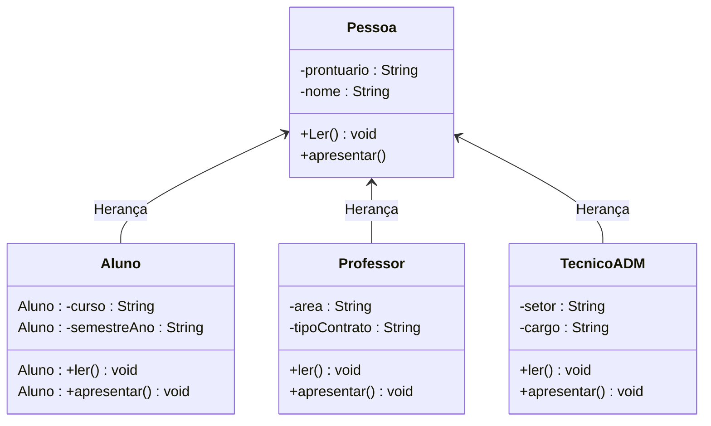
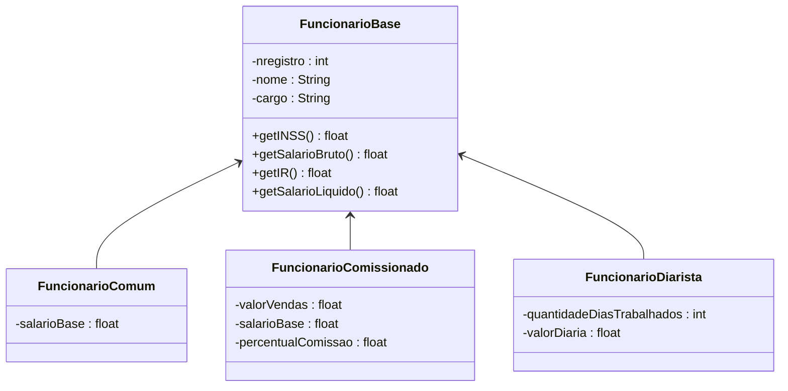

## Exercício 1

Fazer a implementação do seguinte diagrama de classes, onde a superclasse Pessoa possui 3 classes filhas Aluno, Professor e TecnicoAdm. Nas classes filhas os métodos ler() e apresentar() deverão ser sobrescritos, como também os construtores.

Criar um ArrayList para armazenar objetos da classe Pessoa e seja capaz de armazenar objetos das classes Aluno, Professor e TecnicoAdm. Fazer um menu solicitando o tipo de pessoa a cadastrar e chamar o método ler dessas classes e também permitindo listar todos os componentes desse ArrayList.

## Exercício 2 : Banco

Um banco consiste em um conjunto de contas, onde para cada um dos correntistas são necessários os seguintes dados:

- Número da Agência
- Número do Conta
- Nome do Proprietário
- E-mail e Telefone do Proprietário
- Data Abertura
- Saldo

A conta-corrente permite ao proprietário as seguintes ações:

- depositar valores;
- sacar valores;
- transferir valores entre contas;
- ler dados;
- apresentar dados;
- retornar saldo

Além da conta-corrente comum, há outros 2 tipos de contas:

- **conta-corrente especia**l - onde o cliente possui um limite além do seu saldo, que pode ser utilizado em necessidade, ou seja, o cliente poderá transferir ou sacar mais do que tem em seu saldo. Porém sobre o valor utilizado do limite há um juros a ser cobrado pela utilização do mesmo.
- **conta poupança** - onde o cliente possui um percentual de remuneração a ser acrescido a sua conta a cada mês completo.

Fazer um programa utilizando herança, onde em um banco (vetor de contas) será possível fazer a abertura de várias contas, que podem ser conta-corrente comum, conta-corrente especial e a conta poupança. Para cada conta será possível fazer saques, depósitos e transferências para outras contas. O sistema deve permitir ao cliente saber o seu saldo como também os seus dados. Para as contas poupança será permitido fazer a remuneração mensal, onde será passado o percentual de remuneração, e nas contas especiais será permitido aplicar um juros para ser debitado do saldo do cliente, esse juros é fixado na abertura da conta. O sistema deverá ser capaz de apresentar o saldo total dos clientes, como também a quantidade de cada tipo de conta existe.

## Exercício 3 : Folha de Pagamento
Uma empresa necessita controlar sua folha de pagamento, para isso ela necessita controlar os dados dos seus funcionários. Esses funcionários possuem formas diferentes de cálculo de seus vencimentos, dessa forma, há os funcionários com salário fixo, comissionados e os diaristas. Os comissionados, além de um salário base, recebem comissão sobre as vendas realizadas e os diaristas recebem um valor por dia trabalhado.

Para cada um dos funcionários são necessários os seguintes dados:

- Número de registro do funcionário na empresa;
- Nome do funcionário;
- Cargo que ocupa.

Deve-se implementar os getters e setters para os atributos e os seguintes métodos:

- getINSS – retorna o INSS sobre o salário bruto do funcionário, que é de 8% para quem recebe até R$ 2.000,00 e de 11% para quem recebe acima de R$ 2.000,00;
- getIR() - retorna o desconto do IR, que é calculado sobre o salário bruto, onde o valor do IR é de 0 para aqueles que tem salário bruto até R$ 2.000,00, 15% do salário bruto para quem recebe entre R$ 2.000,00 e R$ 4.000,00 e de 25% para quem recebe acima de R$ 4.000,00.
- getSalarioLiquido() - retorna o salário liquido, que é o salário bruto menos os descontos de IR e INSS.
- getSalarioBruto() – definido de acordo com o tipo de funcionário, conforme:
  - FuncionarioComum – O salário bruto é o próprio salário base de sua contratação;
  - FuncionarioDiarista – O salário bruto é calculado pela multiplicação do valor da diária pela quantidade de dias trabalhados no mês;
  - FuncionarioComissionado – O salário bruto é a soma do Salário base com a aplicação do percentual de comissão sobre o valor total das vendas.

A aplicação deverá conter ser capaz de:

1. Cadastrar vários funcionários de diferentes tipos;
2. Apresentar uma listagem contendo o nome do funcionário, o salário bruto, o INSS, o IR e o salário liquido;
3. Apresentar o total do INSS, IR e Salário Liquido.