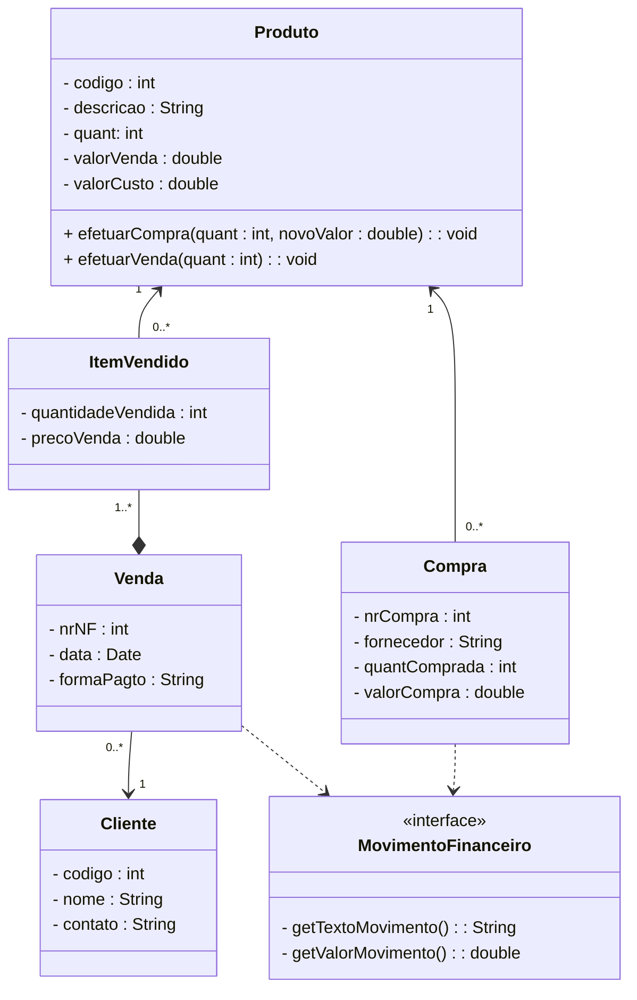

# Trabalho

## Sistema Gerenciador de Estoque

O gerenciamento de estoque consiste na movimentação de compra e venda de produtos de uma empresa e possui os seguintes requisitos:

- Quando um produto é cadastrado, sua quantidade em estoque é 0 (zero).

- Na compra de um produto junto a um fornecedor, a quantidade em estoque do produto é acrescida da quantidade comprada e o valor de compra do produto deve ser atualizado com o valor dessa nova compra.
- Na venda de um produto, a quantidade em estoque é diminuida do estoque atual.
- Se a quantidade a ser vendida for maior que a quantidade em estoque, a venda não pode ser realizada e uma exceção deverá ser gerada.
- O proprietário também necessita saber a movimentação financeira em relação as compras e vendas realizadas.

A figura abaixo apresenta um diagrama de classes para a solução do problema.

A aplicação a ser desenvolvida deve implementar o diagrama de classes. Para esse problema, implementar o relacionamento apenas da compra e venda para o produto e não do produto para a compra e venda. Para isso será necessário a implementação de 4 controles, contendo:

1. Controle de produtos com operações de incluir, excluir, alterar, pesquisar e retornarTodos;
2. Controle de Clientes com operações de incluir, excluir, alterar, pesquisar e retornarTodos;
3. Controle de vendas com operaçõs de incluir, excluir e retornarTodas;
4. Controle de compras com operações de incluir, excluir e retornarTodas;
5. Controle financeiro com operações de retornarSaldo e retornarExtrato.

Os métodos de incluir e excluir do controle de vendas e de compras, deve-se atentar para a atualização do estoque.

A aplicação deverá permitir:

1. Inserir produto;
2. Alterar produto;
3. Excluir produto sem movimentação (opcional);
4. Listar todos os produtos;
5. Inserir cliente;
6. Alterar cliente;
7. Excluir cliente sem movimentação (opcional);
8. Listar todos os clientes;
9. Inserir uma venda;
10. Excluir uma venda (opcional);
11. Inserir uma compra;
12. Excluir uma compra (opcional);
13. Apresentar movimento financeiro;
14. Apresentar saldo do caixa.

Para trabalhar com banco de dados, armazenar os clientes e opcionalmente os produtos dentro do banco, as outras operações podem ser somente em memória (ArrayList estático). Para armazenar em banco será necessário criar as tabelas de cliente e opcionalmente os produto no banco e colocar o script utilizado.